<h1 align="center">Hi, I'm De1v</h1>

<h3 align="center">A <strong>full-stack developer</strong> from the Czech Republic </h3>

<h3 align="center">📓Knowledge</h3>

  <a>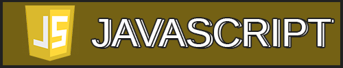</a>
  <a>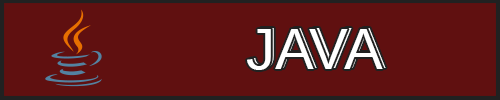</a>
  
  
  <a>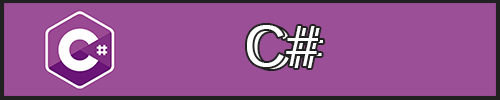</a>

  <a>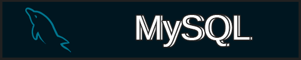</a>
  <a>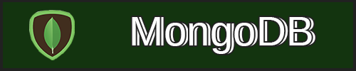</a>

  <a>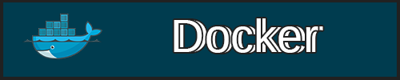</a>
  <a>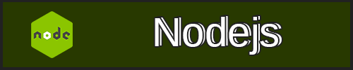</a>
  <a>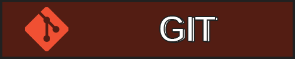</a>

 

<h3 align="center">💪Frameworks that I using/used</h3>

  <a href="https://reactjs.org/">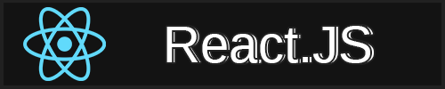</a>
  <a href="https://vuejs.org/">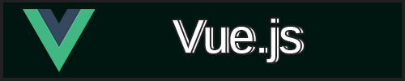</a>
  <a href="https://qwik.builder.io/">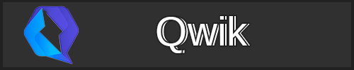</a>
  <a href="https://expressjs.com/">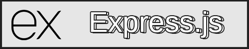</a>

 

📫 <strong>How to reach me 👇</strong>

  

 

  

